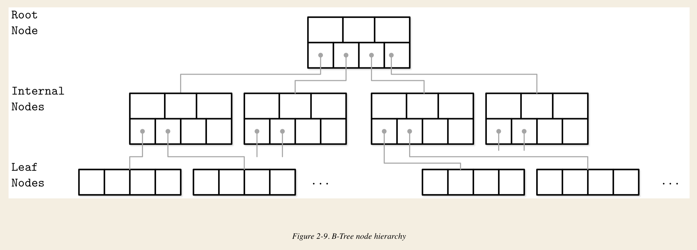
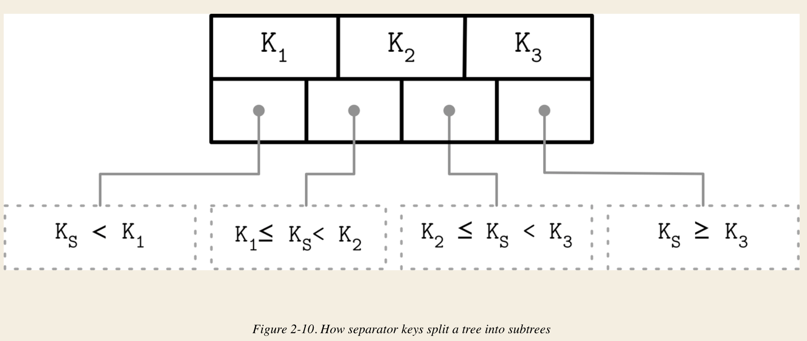
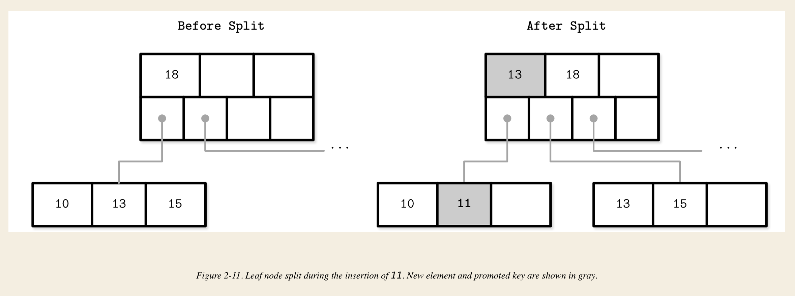
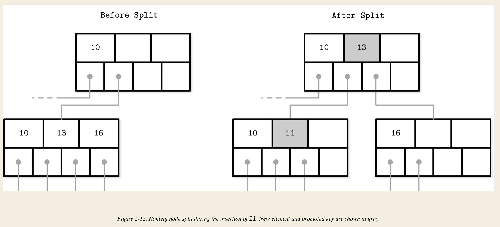
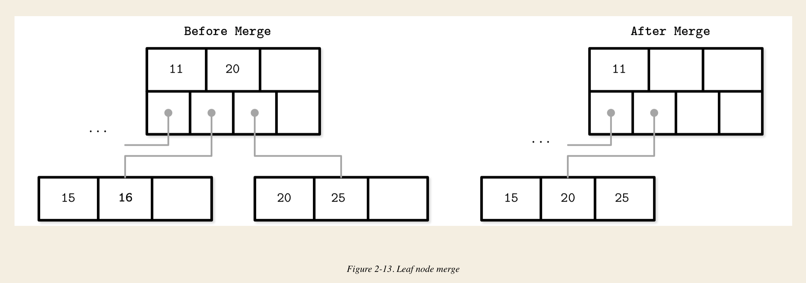
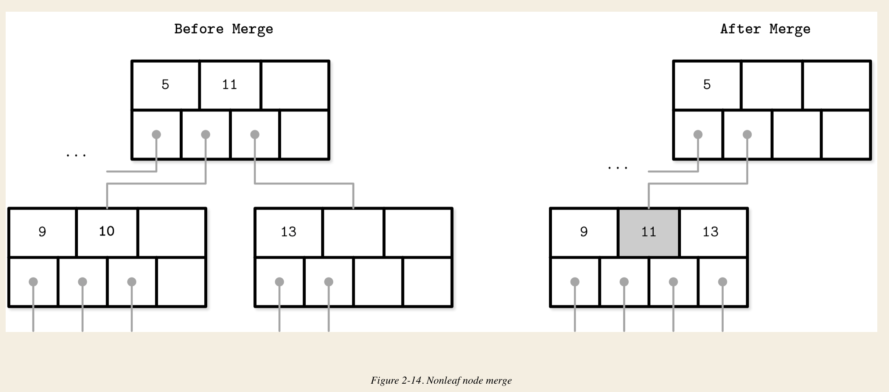

# Chapter 1

## DBMS major categories: 
- Online transaction processing (OLTP) databases
- Online analytical processing (OLAP) databases
- Hybrid transactional and analytical processing (HTAP)

The main limiting factors on the growth of in-memory databases are RAM volatility (in other words, lack of durability) and consts. 

### Row-Oriented / Column-Oriented DBMS
Row-oriented store: MySQL, PostgreSQL
Column-oriented store: MonetDB, C-Store

Wide-column stores -- BigTable, HBase

### Data Files and Index Files
Data Files:
- **index-organized tables** (IOT) store data in the index itself. order by key.
- **heap-organized tables** (heap files). Records are not in particular order, placed in write order. needs additional index structure
- **hash-organized tables** (hashed files) store data in the buckets by hash value of the key.

Index files:
- primary index is actually the primary key or a set of keys identified as primary. 
- secondary indexes can point directly to the data record, or simply store its primary key. (There are pros and cons for both of them. pointing directly can save look up time, but need to maintain the pointer if data record gets changed. While store primary key will have overhead on look up, but saves pointer maintainence. 
- primary indexes are most often clustered, while secondary indexes are nonclustered by definition, since they are used to facilitate access by keys other than the primary one. 

### The three common variables for various storage structures
- **buffering (or not)** defines whether or not the storage structure choose to collect a certain amount of data in memory before putting it on disk;
- **immutable (or mutable) file** defines whether or not the storage structure reads parts of the file, updates them, and writes the updated results at the same location in the file. Immutable structures are *append-only*
  - *copy-on-write* means modified page, holding the updated version of the record, is written to the new location in the file
- **store value in order (or out of order)** defines as whether or not the data records are stored in the key order in the pages on disk. Ordering often defines whether or not we can efficiently scan the range of records. However storing data out of order opens up for some write-time optimization.

# Chapter 2 B-Tree Basics

## B-Tree alternatives

### Binary Search Tree
Balanced BST needs frequent balancing, relocating nodes and updating pointers. Increased maintenance consts make BSTs impractical as on-disk data structures.

BST has locality problem, node child ponters may span across several disk pages. 
BST also have low fanout (2 child) rate, which leads to large depth (more searching time).

So ideally, a type of tree should be 
1. *high fanout* to improve locality of the neiboring keys;
2. *low height* to reduce the number of seeks during traversal.

## Disk-Based Structures

### Hard Disk Drives 
One spining disks, *seeks* increases costs of random reads because they require disk rotation and mechanical head movements to position the read/write head to the desired location. However, once the expensive part is done, reading or writing contiguous bytes (i.e. sequential operations) is relatively cheap.
The smallest transfer unit of a spinning drive is a *sector*, so when operation is performed, at least an entire sector can be read or written. Sector size typically range from 512 bytes to 4Kb.
Head positioning is the most expensive part of an operation on the HDD. This is one of the reasons we often hear about the positive effects of *sequential I/O*: reading and writing contiguous memory segments from disk.

### Solid State Drives
No disk that spins, or head that has to be positioned for the read. SSD is built of *memory cells*, connected into *strings*, string are combined into *arrays*, arrays are combined into *pages*, and pages are combined into *blocks*. Blocks are organized into planes and planes are placed on a *die*. SSDs can have one or more dies.

In SSDs, the difference in latencies between random and sequential reads is not as large. 

Though GC is usually background operation, its effects may negatively impact write performance.

Most OS have a *block device* abstraction. It hides an internal disk structure and buffers I/O operations internally, so when we're reading a single word from a block device, the whole block containing it is read. We cannot ignore this constraint while working with disk-resident data structures.

## On-Disk Structures
The main limitation and design condition for building efficient on-disk structure is **the smallest unit of disk operation is a block**. We changed the layout of the data structure to take advantage of it.
Can do this by improving locality, optimizing the internal representation of the structure, and reducing the number of out-of-page pointers.

## Ubiquitous B-Trees
B-Trees build upon the foundation of balanced search trees and are different in that they have higher fanout and smaller height.

B-Trees consist of multiple nodes. Each node holds up to **N keys** and **N+1 pointers** to the child nodes. These nodes are grouped into three groups: root nodes, internal nodes, leaf nodes.

### Separator Keys
Keys stored in B-Tree nodes are called *index entries, separator keys* or *divider cells*. They split the tree into subtrees, holding corresponding key ranges. 

B-Tree reserves extra space inside nodes for future insertion and updates, tree storage utilization (*occupancy*) can get as low as 50%.

### B-Tree node splits
Splits are done by allocating the new node, tranfering half the elements from the splitting node to it, and adding its first key and pointer to the parent node. In this case, we say that key is *promoted*. If the parent node is full and does not have space for the promoted key and pointer to the newly created node, it has to be split as well. As soon as the tree reaches its capacity, root node has to be splitted. (height + 1)

In this way, the way B-Tree grows is from bottom up.

### B-Tree Node Merges
If neighboring nodes have too few values, the sibling nodes are merged. This situation is called *underflow*. 
If two adjacent nodes have a common parent and their contents fit into a single node, their contents should be merged; if their contents do not fit into a single node, keys are redistributed between them to restore balance (*rebalancing*).

1. Copy all elements from the right node to the left node.
2. Remove the right node pointer from the parent (or demote it in the case of nonleaf merge)
3. Remove the right node.

# Chapter 3 File Formats

Data layout is much less important in memory than on disk. 

