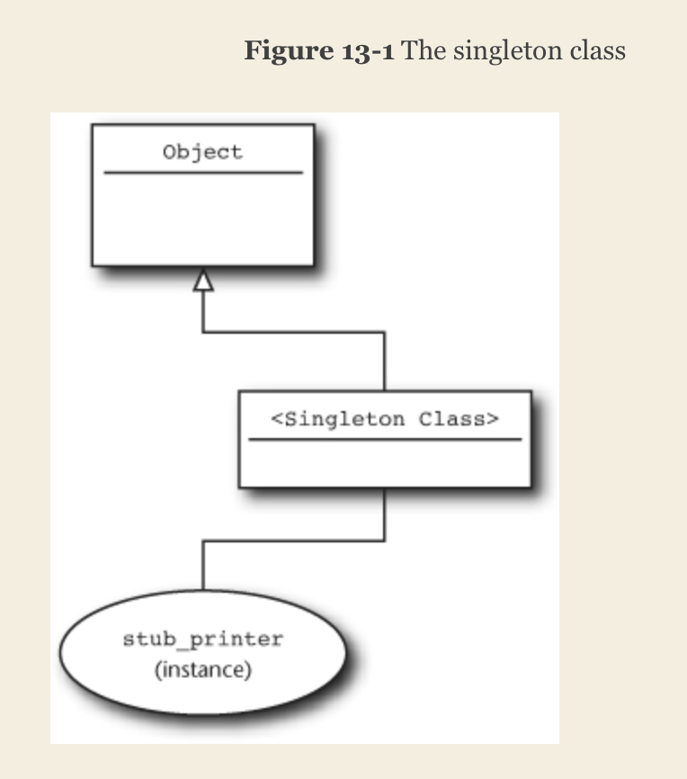

# Chapter 1

> These kinds of “how to” comments should focus on exactly that: how to use the thing. Don’t explain why you wrote it, the algorithm that it uses, or how you got it to run faster than fast. 

> as the old bit of programming wisdom says, good code is like a good joke: It needs no explanation.

Camels for classes, snakes everywhere else. (`ALL_UPPERCASE` flavor of constant)

Paretheses are optional for function definition and ivocation. Do not add paretheses for methods with empty argument. Conditional statements **do not need paretheses**.

A good way to learn Ruby code is to read Ruby [Standard library source code](https://github.com/ruby/ruby/tree/master/lib).


# Chapter 2 Control Structure

`unless` <-> `if not`

`until` <-> `while !`

## Modifier form
 `@title = new_title unless @read_only`
 
 `doc.print_next_page while doc.pages_available?`
 
 `doc.print_next_page while doc.printed?`
 
 _Do this if that_
 
 
 ## Use each, not for
 ```
# for font in fonts
#   puts font
# end
 
 fonts.each do |font|
  puts font
 end
 ```
 
 > Mainly it is a question of eliminating one level of indirection. Ruby actually defines the for loop in terms of the each method: When you say `for font in fonts`, Ruby will actually conjure up a call to `fonts.each`. 
 
 
## `case`
```
case ticker
when 'AAPL'
  puts 'apple'
when 'AMZN'
  puts 'amazon'
else
  puts 'I don't know'
end
```

assign value computed from `case`
```
company = case ticker
          when 'AAPL' then 'apple'
          when 'AMZN' then 'amazon'
          else 'I don't know'
          end
```

`case` statements use `===` to do comparisons, which means you can use `case` to switch on the class of object, detect regular expressions and supply your own conditions

## Boolean logic
only `false` and `nil` are treated as false, everything else is treated as true. (`0` is also evaluated as `true`)


```
# init variable if it is nil
@first_name = '' unless @first_name

# it is the same as 
@first_name ||= ''
# this is more concise but with caveat, if @first_name is false, then it will assign '' to @false_name
```

# Chapter 3 Smart Collections

Creating arrays, hashes

```
names = ['Alan', 'James', 'Tracy']

# is same as 
names = %w{Alan James Tracy}
```

## function arguments 
You can specify how many arguments are needed with defaults
```
def print_name( first, last='Yang' }
  # do things
end

print_name ('Jason')
```

`*` means function can take arbitrary number of arguments
```
def print_labels( first, *args, last)
  message = first
  message += " #{args.join(' ')}"
  message += last
  puts message
end
```

## Iterate collections
```
words = %w{This is a sentence}

# do not use this verbose version
for i in 0..words.size
  puts words[i]
end

# use each
words.each { |word| puts word }

# iterate hash
m = {time: 2021, location: 'NJ', event: 'study'}
m.each {|w| pp w}

# or
m.each { |field, value| puts "#{field} => #{value}" }
```

## useful collection APIs
```
# find_index
def index_for (word)
  words.find_index { |this_word| word == this_word }
end

# map
pp words.map { |word| word.size }
# will give you [3, 5, 2]

# inject -- passes two arguments to the block
def total_word_length
  words.inject(0) { |result, word| word.size + result }
end
```

### `!` for collection mutation
```
a = [1, 2, 3]
# return a copy of reverse array
a.reverse

# mutate array, reverse in place
a.reverse!

# the same for sort v.s. sort!
```

> Don’t, however, get the idea that only methods with names ending in ! will change your collection. Remember, the Ruby convention is that an exclamation point at the end of a method name indicates that the method is the dangerous or surprising version of a pair of methods. Since making a modified copy of a collection seems very safe while changing a collection in place can be a bit dicey, we have sort and sort!. 

## Keys in hashes are ordered
Ordered in the way it is created, later added items will appear at the end. Changing values won't change the key order.


> There are two reasons for this preference for the bare collections over more specialized classes. First, the Ruby collection classes are so powerful that often there is no practical reason to create a custom-tailored collection simply to get some specialized feature. Frequently, a call to each or map is all you really need. And second, all things being equal, Ruby programmers actually prefer to work with generic collections. To the Ruby way of thinking, one less class is one less thing to go wrong. In addition, I know exactly how an array is going to react to a call to each or map, which isn’t necessarily true of the SpecializedCollectionOfStuff. When the problem is complexity, the cure might just be simplicity.

## caveats
take care when adding new elements well past the existing end of array
```
array = []
# 123457 new elements will be created with 123456 of them nil
array[123456] = 1
```

Also remember there is a `Set` class to use!


# Chpater 4 Smart Strings

Embed arbitrary expression in a __double quoted string__ by enclosing the expression between `#{` and `}`.
```
first_name = "Joe"
last_name = "Biden"
puts "The name is #{first_name} #{last_name}"
```

Escape
```
str = '"Stop", she said, "I can\'t live without \'s and "s."'

# %q to have same spirit of single quoted string
str = %q{"Stop", she said, "I can't live without 's and "s."}
str = %q("Stop", she said, "I can't live without 's and "s.")
str = %q<"Stop", she said, "I can't live without 's and "s.">

# %Q to have same spirit as double quoted string
str = %Q<The time in now #{Time.now}>

```

Span string multi-lines
```
str = "a long
string"

str = %q{a long
string}

puts str
# will show: a long 
#            string

str = %Q<a long \
string>
puts str
# will show: a long string

str = <<~P
 Here is how to 
 construct a string 
 that span across multiple 
 lines!
P
# can also use <<-P but that will leave the identation as it is.
```

Decision: it seems `%Q{}`  will be the best way to write complex string literals while single quoted string is the simplist.

## String API
```
# strip, lstrip, rstrip
' hello'.lstrip   # ->'hello'
' world '.strip    # ->'world'

# chomp to remove one line-terminating \n
# chop to remove trailing character
'hello\n\n\n'.chomp.   # 'hello\n\n'
'hello'.chop.   # 'hell'

# swapcase

# sub to substitute first occurance
'It was warm outside.'.sub('warm', 'cold')

# gsub to substitute all occurances
'yes yes'.gsub('yes', 'no')

'hello world'.split   # ["hello", "world"]
'1234:567:89'.split(':') # ["1234". "567", "89"]

# trailing ! after method will mutate the string instead of return a modified copy


"Here we go".index("go") # returns 2
```

## play with characters and bytes
```
str = 'hello'

str.each_char {|c| puts c}

str.each_byte {{b} puts b}

str2 = "hello
world"

str2.each_line { |l| puts l}
```

## variables are assigned by ref
```
str = "apple"
str2 = str
str.upcase!
puts str2  # APPLE
```


# RegEx
```
[0-9a-zA-Z]

\d matches any digits
\w matches any letterm number or underscore

A|B matches either A or B

\d:\d (AM|PM) matches time format 11:59 AM
```

RegEx in Ruby
```
# surround with forward slashes will make a RegEx
puts /\d:\d (AM|PM)/ =~ '10:23 AM'  # prints 0, means regex matches starting from index 0

puts /AM/ =~ '10:23 AM' # prints 6 means regex matches starting from index 6

puts /AM/ =~ '10:23' # prints nothing means regex does not match

# trailing i after regex will disable case sensitivity
puts /AM/i =~ 'am' # prints 0

# sub() and gsub can take a regex

# \A only matches start of a string
# \z only matches end of a string

# ^ matches start of a string or start of new line in a string
# $ matches end of a string or end of a line in a string

# trailing m will disable the fact that .* cannot match multiple lines
```

# Chapter 6 Symbols in Ruby

There can only ever be one instance of any given symbol

```
a = :all
b = a
c = :all

a == c # true
a === c # true
```

Symbols are immutable

In ruby, hash key are also immutable. There are sepcial defenses built in to guard against changing of hash keys.

```
# use to_s to turn a symbol into string
str = :all.to_s

# use to_sym to turn a string to symbol
the_symbol = 'all'.to_sym
```

_Use string for data, treat symbol as 'stand for', a const expression_


# Chapter 7 Everything is an object

class inheritance
```
class Dog < Animal
# ...
end
```

Everything is an object, including `nil`

```
puts nil.class # NilClass
puts nil.class.class # Class
```

All classes is inherited fron `Object`, `Object` bestows about fifty methods to its children.


`eval("some command")` to run the command as Ruby

Class methods are public by default, can expliciylt make them `private` and `protected`


`to_s` is a method of `Object` so if you `puts SomeClass`, `to_s` will get called to convert `SomeClass` to string and print it. You can override `to_s` in `SomeClass` to have your own printing format

> In a very real way, the Object class is the glue that binds Ruby together and lends the language its simple elegance.


# Chapter 8 Dynamic Typing

Ruby does not judge an object by its class hierarchy. If an object has the right methods, then it's the right kind of object. so called __Duck Typing__


> When you are coding, anything that reduces the number of revolving mental plates is a win. From this perspective, a typing system that you can sum up in a short phrase, “The method is either there or it is not,” has some definite appeal. If the problem is complexity, the solution might just be simplicity.


# Chapter 9 Write Specs!

## Test::Unit

```
require 'test/unit'

class DocumentTest < Test::Unit::TestCase
 # setup and teardown are called for each test case.
 def setup
  @text = 'a lot of words'
  doc = Document.new('test', 'author', @text)
 end
 
 def teardown
  # can close database connections, close socket, etc.
 end
 
 def test_doc_holds_onto_contents
  assert_equal @text, @doc.content, 'Check contents are still there'
 end
 
 def test_doc_can_return_words_in_array
  text = 'some more words'
  doc.Document.new('test', 'author', text)
  assert @doc.words.include?('a')
  assert @doc.words.include?('lot')
  assert @doc.words.include?('of')
  assert @doc.words.include?('words')
 end
 
 def test_word_count_is_correct
  asssert_equal 4, doc.word_count, 'Word count is correct'
 end
end
```

More assertions

```
assert_not_equal
assert_nil
assert_not_nil

assert_match /\d\d/, '23'

assert_instance_of String, 'hello'

# assert code will raise an exception
assert_raise ZeroDivisionError do
 x = 1/0
end

# assert code will not raise exception
assert_nothing_thrown do 
 x = 1/2
end


```

## Don't test it, spec it!

> RSpec tries to weave a sort of pseudo-English out of Ruby: The code above isn’t a test, it’s a description. 

Use `spec` to run your ruby spec files
```
spec document_spec.rb

# run all spec files in a whole directory tree (file will naming format <file>_spec.rb)
spec .
```

Example of spec file
```
require 'document'

describe Document do
 # similar to setup in Test::Unit, run before each test case
 before :each do 
  @text = 'a lot of wrds'
  @doc = Document.new('test', 'author', @text)
 end
 
 after :each do
  # run after each test case
 end
 
 # before :all and after :all to run before or after all test cases
 
 it 'should hold on the the contents' do
  @doc.content.should == @text
 end
 
 it 'should know which words it has' do
  @doc.words.should include('a')
  @doc.words.should include('lot')
  @doc.words.should include('of')
  @doc.words.should include('word')
 end
 
 it 'should know how many words it contains' do
  @doc.word_count.should == 4
 end
 
end
```

### Mocking in spec 

stub and mock
```
class PrintableDocument < Document
 def print( printer )
  return 'Printer unavailable' unless printer.available?
  printer.render( '#{title}\n' )
  printer.render( 'By #{author}\n' )
  printer.render( context )
  'Done'
 end
end

describe PrintableDocument do 
 before :each do 
  @text = 'a lot of wrds'
  @doc = Document.new('test', 'author', @text)
 end
 
 # stub
 it 'should_know how to print itself' do
  stub_printer = stub :available? => true, :render =>nil
  @doc.print( stub_printer ).should == 'Done'
 end
 
 it 'should return proper string if printer is not available' do
  stub_printer = stub :available? =>false, :render => nil
  @doc.print( stub_printer ).should == 'Printer unavailable'
 end
 
 # mock
 it 'should know how to print itself with mock' do
  mock_printer = mock('Printer')
  mock_printer.should_receive(:available?).and_return(true)
  mock_printer.should_receive(:render).exactly(3).times
  @doc.print(mock_printer).should == 'Done'
 end
 
end
```


```
# stub! can be used to stub out methods on any regular object
str = 'short string'
str.stub!(:length).and_return(10000)
```

### shoulda
```
require 'test/unit'
require 'shoulda'

class DocumentTest < Test::Unit::TestCase
 context 'a basic document class' do
  def setup
   @text = 'a lot of words'
   doc = Document.new('test', 'author', @text)
  end

  should 'hold on to the contents' do
   assert_equal @text, @doc.content, 'Check contents are still there'
  end
 end
end
```

MiniTest is also something to explore


> Unit tests should run quick with the setup that every developer has. They are your first line of defense, and in order to be any good they must be run often.


# Chapter 10 Construct Class

`attr_reader` for readable data members

`initialize` for constructor

The cost of defining a new method in Ruby is very low. Prefer having many fine-grained method than fewer monilith methods.

# Chapter 11 Operator Overloading

Ruby embraces operator overloading!

```
sum = first + second 
# is actually doing the following underneath
sum = first.+(second)
```

```
class Document
 # Binary operator
 def +(other)
  Document.new( title, author, "#{content} #{other.cotent}")
 end
 
 # Unary operator
 def !
  Document.new(title, author, "It is not true: #{content}")
 end
 
 def +@
  Document.new(title, author, "I'm sure that #{content}")
 end
end

chocalate = Document.new('chocalate', 'me', 'chocalate is the best!')
no_chocalate = !chocalate

surely_chocalate = +chocalate
```


Operators that can not be overloaded: `not`, `and`, `or`, `||`, `&&`


# Chapter 12 Object Equality

4 equality sign: `equal?`, `eql?`, `==`, `===`

`equal?` will always compare if two variable are referenced to the same object, if not it will always return `false`. __Do not overload `equal?`__

`==` for everyday use. By default, `==` will do the same comparison as `equal?`. It needs to be overloaded to have customized comparison.

```
class Person
 attr_reader :first_name, :last_name
 
 def initialize(first_name, last_name)
  @first_name = first_name
  @last_name = last_name
 end
 
 def ==(other)
  return true if other.equal?(self)  # this will speed up comparison if two objects are referencing to same thing
  return false unless other.instance_of?(self.class)
  first_name == other.first_name && last_name == other.last_name
 end
end
```

`kind_of?` to know if the class is subclass of another one. 

```
class Person
 # ...
 def ==(other)
  return true if other.equal?(self)
  return false unless other.kind_of?(self.class)
  first_name == other.first_name && last_name == other.last_name
 end
end

class SalesPerson < Person
end

puts 'two person are equal' if Person.new('first', 'last') == SalesPerson.new('first', 'last')
```

```
# take advantage of dynamic typing
class Person
 # ...
 def ==(other)
  return true if other.equal?(self)
  return false unless other.respond_to?(:first_name)
  return false unless other.respond_to?(:last_name)
  first_name == other.first_name && last_name == other.last_name
 end
end
```

equality should meet the principle of __symmetry__ and __transitive property__


## Triple Equals for case statements

```
location = 'area 81'

case location
when /area.*/
 # ...
when /rosewell.*/
 # ...
else
 # ...
end
```

By default, `===` calls `==`. 

## Hash tables and `eql?`

When you want to have an object as hash key, you need to define `eql?` and `hash`.

```
class Person
 # ...
 
 def hash
  first_name.hash ^ last_name.hash
 end
 
 def eql?(other)
  return true if other.equal?(self)
  return false unless other.kind_of?(self.class)
  first_name == other.first_name && last_name == other.last_name
 end
end
```

By default, `eql?` will call `equal?`. The default hash method returns `object_id` of the object, which is guranteed to be unique. 


# Chapter 13 Singleton and class methods

stubs are singletons

```
stub_font = stub :size => 14, :name => 'Courier'
stub_printer = stub :available? => true, :render => nil

puts stub_printer.class # Spec::Mocks::Mock
puts stub_font.class # Spec::Mocks::Mock
```

Define singleton

```
str = 'hello'

def str.class
 'secret'
end

puts str.class
```

```
stub_printer = Object.new

class << stub_printer
 def available?
  true
 end
 
 def render
  nil
 end
end
```
You really define a singleton by defining a method for this object

> So how does Ruby pull off the singleton method trick? The key is that every Ruby object carries around an additional, somewhat shadowy class of its own. As you can see in Figure 13-1, this more or less secret class—the singleton class—sits between every object and its regular class.3 The singleton class starts out as just a methodless shell and is therefore pretty invisible.4 It’s only when you add something to it that the singleton class steps out of the shadows and makes its existence felt.
> Since it sits directly above the instance, the singleton class has the first say on how the object is going to behave, which is why methods defined in the singleton class will win out over methods defined in the object’s regular class, and in the superclasses.




```
# you can also define singleton like this
singleton_class = class << stub_printer
 self
end
```

A powerful usage of singleton method is it can be used to define __class methods__. 

```
class Person
end

def Person.describe
 puts "self is #{self}"
 puts "and its class is #{self.class}"
end

```

```
# defining class methods
class Document
 class << self
  def find_by_name (name)
   # ...
  end
  
  def find_by_id(doc_id)
   # ...
  end
 end
 
 def self.who_am_i
  puts "The value of self is #{self}"
 end
end
```

> Remember, when you define a class method, it is a method attached to a class. The instances of the class will not know anything about that method. 


# Chapter 14 Class instance variable (class level data)

## Class variable
Class variable starts with `@@`

> If the class variable is not defined in the current class, Ruby will go looking up the inheritance tree for it. 

class variable could lead to ambiguity, don't use it. Use class instance variable instead.

## Class instance variable

```
class Document
 
 @default_font = :times
 
 def self.default_font=(font)
  @default_font = font
 end
 
 def self.default_front
  @default_font
 end
 
end

Document.default_font = :arial
```

Above can be simplified as 

```
class Document
 @default_font = :times
 
 # This will replace self defined getter and setter
 class << self
  attr_accessor :default_font
 end
end
```
Essentially, things defined in `class << self` block is class level thing, including variables and methods

# Chapter 15 Use Modules as Name Spaces

> A Ruby module is the container part of a class without the factory. You can’t instantiate a module, but you can put things inside of a module. Modules can hold methods, constants, classes, and even other modules.

```
module Company
 class Assets
  ...
 end
 
 class Building
  ...
 end
 
 class Employee
  ...
 end
 
 # module can be nested 
 module Department
  ...
 end
end

# referencing Assets
Company::Assets

include Company
b1 = Building.new(...)
```


Module can be home for utility methods

```
module Company
 
 # the `self` is very important, it means it's a module method
 def self.name
  'company'
 end
end

company_name = Company.name
```

Module can be spread out to multiple files.

Module is also an object

```
the_module = Company

a = the_module::Employee.new(...)
```

> So when should you create a name space module and when should you let your classes go naked? An easy rule of thumb is that if you find yourself creating a lot of names that all start with the same word, perhaps TonsOTonerPrintQueue and TonsOTonerAdministration, then you just may need a TonsOToner module.


> To underscore the idea that a little bit of module goes a long way, consider DataMapper. DataMapper is a database interface library similar to ActiveRecord. In about 7,500 lines of pretty heavy-duty code, the core of DataMapper uses primarily a three- and occasionally four-level module hierarchy. If DataMapper can limit itself to a very shallow, manageable module structure and still talk to MYSQL, Postgres, and SQLite, chances are pretty good that a modest handful of modules will work for your project too.


# Chapter 16 Use module as mixins

> When you include a module into a class, the module’s methods magically become available to the including class.

> The Ruby jargon is that by including a module in a class you have mixed it in to the class. We say that the module itself, WritingQuality in this case, is a mixin module. 

```
module Common
 def common_method
 end
end

class Company
 include Common
end

class Person
 include Common
end

c = Company.new
c.common_method

p = Person.new
p.common_method
```

Include a module to make its methods the class methods

```
class Company
 class << self
  include Common
 end
end

Company.common_method
```

Above can be simplified as 

```
class Company
 extend Common
end
```

> When you mix a module into a class, Ruby rewires the class hierarchy a bit, inserting the module as a sort of pseudo superclass of the class. The module gets interposed between the class and its original superclass.


Because of the heirarchy change, you can also override module methods in your class and subclasses.

Module included first will have higher position in heirarchy. So if `module1` and `module2` both have `common_method`. 

```
class Company
 include module1
 include module2
end
```

calling `c.common_method` will call the function from `module2`


# Chapter 17 Use blocks to iterate

> Ruby convention is to name the main iterator of your class `each`

Creating methods that use blocks. `yield`
```
class Document
 def each_word
  index = 0
  while index < @content.size
   yield( @content[index] )
   index += 1
  end
 end
end

d = Document.new('a long document')
d.each_word {|word| puts word}
```

```
def do_something
 yield if block_given?
end

do_something do
 puts 'hello'
end

do_something { puts 'hello'}
```

Minxin with `Enumerable` module to enhance your class functioanlity

```
class Document
 include Enumerable
 
 # !! must have each method defined to have features of Enumerable
 def each
  words.each { |word| yield( word ) }
 end
end

d = Document.new('a long doc')
puts doc.include?('long')
# to_a (to array) is available
# find, find_all are available
# each_cons
# each_slice
```
`Enumerable` adds ~40 methods to your class

`Enumerator` class

Do not mutate underlying collection in iterator functions. Soley work on the current item. 


# Chapter 18 Executed aournd with a block

```
class SomeApplication
 def do_something
  with_logging('load') { @doc = Document.load('resume.txt') }
  
  # ...
  
  with_logging('save') { @doc.save }
 end
 
 def with_logging(description)
  begin
   @logger.debug( "Start #{description}" )
   yield
   @logger.debug( "Completed #{description}" )
  rescue
   @logger.error( "#{description} failed!" )
   raise
  end
 end
end
```

> In fact, exception handling is even more important with execute around than it is with iterators, because execute around is all about guarantees. The whole idea of execute around is that the caller is guaranteed that this will happen before the code block fires and that will happen after. Don’t let some stray exception sully the reputation of your method for absolutely, positively getting the job done.

> Execute around suggests that you build a method that takes a block; inside of that method you execute whatever code needs executing before and after you call the block.


# Chapter 19 Save blocks to execute later

## Explicit blocks
```
def run_that_block( &that_block )
 puts 'About to run the block'
 that_block.call if that_block
 puts 'Done running the block'
end
```

## Instant block objects
```
class Document
 DEFAULT_LOAD_LISTNER = lambda do |doc, path|
  puts "Loaded: #{path}"
 end
 
 DEFAULT_SAVE_LISTNER = lambda do |doc, path|
  puts "Saved: #{path}"
 end
 
 attr_accessor :title, :author, :content
 
 def initialize( title, author, content='' )
  @title = title
  @author = author
  @content = content
  @save_listner = DEFAULT_SAVE_LISTNER
  @load_listner = DEFAULT_LOAD_LISTNER
 end
```

> you should keep in mind the stuff that you might be unconsciously dragging along with your blocks.


# Chapter 20 Hooks

## `inherited` for class inheritance
```
class BaseClass
 def self.inherited (new_subclass)
  puts "#{new_subclass} is now a subclass of #{self}"
 end
end

class ChildClass < BaseClass
end
# this will print "ChildClass is now a subclass of BaseClass"
```

## `included` for module include
```
module SimpleModule
 def self.included(host_class)
  puts "Hey, I've been included in #{host_class}"
 end
end
```

## `at_exit` hook gets called before Ruby interpreter exits. 
```
at_exit do
 puts 'bye'
end
```

`method_missing` to track methods being added to a class
`trace_var` to track changes to global variables


# Chapter 21 `method_missing` for flexible error handling

> When Ruby fails to find a method, it turns around and calls a second method. This second call, to a method with the somewhat odd name of method_missing, is what eventually generates the exception: It’s the default implementation of method_missing, found in the Object class2 that raises the NameError exception.

```
class RepeatBackToMe
 def method_missing(method_name, *args )
  puts "Hey, you just called the #{method_name} method"
  puts "With these arguments: #{args.join(' ')}"
  puts But there ain't no such method"
 end
end
```


`const_missing` for flexible error handling for constant that does not exist.

```
class Document
 def self.const_missing( const_name )
  msg = %Q{
   You tried to reference the constant #{const_name}
   There is no such constant in the Document class.
  }
  raise msg
 end
end
```

> you don’t want to use it unless you really need it. The garden-variety Ruby error handling will suffice for about 99.9% of all of your misspelled or misplaced methods

> keep in mind that the penalty for screwing up in method_missing and const_missing can be pretty high


# Chapter 22 `method_missing` for delegation

```
class SuperSecreteDocument
 def initialize(original_document, time_limit_seconds)
  @original_document = original_document
  @time_limit_seconds = time_limit_seconds
  @create_time = Time.now
 end
 
 def time_expired?
  Time.now - @create_time >= @time_limit_seconds
 end
 
 def check_for_expiration
  raise 'Document no longer available' if time_expired?
 end
 
 def method_missing(name, *args)
  check_for_expiration
  @original_document.send(name, *args)
 end
end
```

To delegate, own the target object as data variable, implement `method_missing` to invoke the corresponding method of target object. In this way you can save lots of code copying methods from target object.

`super` to call the same method of parent class.


## delegate.rb

There is a library to achieve delegation in a even simpler way.

```
require `delegate`

class DocumentWrapper < SimpleDelegator
 def initialize( real_doc )
  super( real_doc )
 end
end
```


# Chapter 23 `method_missing` for flexible APIs

```
# create unlimited APIs for replacing words in text.
# e.g. replace_name will replace NAME 
#      replace_city will replace CITY, etc.
class FormLetter < Document
 def replace_word( old_word, new_word )
  @content.gsub!( old_word, "#{new_word}" )
 end
 
 def method_missing( name, *args )
  string_name = name.to_s
  return super unless string_name =~ /^replace_\w+/
  old_word = string_name.split('_')[1].upcase
  replace_word( old_word, args.first )
 end
```

Use `method_missing` is likely to mess up `respond_to?`: The 'method' created by `method_missing` will still have `respond_to?` return false since those methods are not real methods of this class.


`OpenStruct` uses this technique.


# Chapter 24 Open class (monkey patching)

> Ruby’s open classes means that you can change the behavior of any class at any time. You can add new methods. You can replace the code behind an existing method. You can even delete methods altogether. 

In Ruby when you write another class with same name of some exsiting class, you are not defining a new class, you are modifying the existing class! Including adding new methods and overriding existing methods!

You can also improve (add patches to) existing methods. 

Renaming methods with `alias_method`
```
class Document
 def word_count
  words.size
 end
 
 alias_method :number_of_words, :word_count
 # alias_method will give a fresh copy of word_count, so if word_count is changed below this line, number_of_words won't change along with it.
 alias_method :size_in_words, :word_count
end
```

Open class allows you to change data member visibility, e.g. `private` to `public`, remove method by `remove_method`


# Chapter 25 Create self-modifying class

> Ruby classes are defined piecemeal, one step—or method—at a time. When Ruby sees that initial `class LessEmpty`, it creates a new and completely empty class. It then executes the class body, the code between the class statement and the final end. Whatever is inside the class definition—be it an if or a puts or a method defining def—simply gets executed in turn.


Above means you can put programming logic into class definition
```
class Document
 def save( path )
  File.open( path, 'w' ) do |f|
   f.puts( encrypt( @title ))
   f.puts( encrypt( @author ))
   f.puts( encrypt( @content )
  end
  
  if ENCRYPTION_ENABLED
   def encrypt( string )
    string.tr( 'a-zA-Z', 'm-za-lM-ZA-L')
   end
  else
   def encrypt( string )
    string
   end
  end
 end
```


# Chapter 26 Create classes that modify their subclasses

Class modifying methods

```
# There will lots of subclasses of StructuredDocuments, you want an easy way to define methods for those subclasses

class StructuredDocument
 def self.paragraph_type( paragraph_name, options )
  name = options[:font_name] || :arial
  size = options[:font_size] || 12
  emphasis = options[:font_emphasis] || :none
  
  # define_method takes argument as the to be defined method name, execute a block for method implementation.
  define_method(paragraph_name) do |text|
   paragraph = Paragraph.new( name, size, emphasis, text )
   self << paragraph
  end
 end
 
end

# Then for subclasses, you can do: 
class Instruction < StructuredDocument
 paragraph_type( :introduction,
  :font_name => :arial,
  :font_size => 18,
  :font_emphasis => :italic)
  
 # calling the class method above is the same as defining a method called introduction
 #  def introduction(text)
 #    p = Paragraph.new(:arial, 18, :italic)
 #    self << p
 #   end
end

```


# Chapter 27. Invent Internal DSLs

__Domain Specific Language__

> This is the way that many Ruby internal DSLs are born: You set out to build a helpful class with a good API, and gradually that API gets so good that it forgets that it’s just an API. This is also where many Ruby APIs finish, which is fine since there is nothing wrong with a really good, natural-feeling, almost DSL-style API. Sometimes, however, you want to go further. You might want to take the next step if you need to write a lot of scripts, if there are a lot of programmers who will need to use your utility.


# Chapter 28. External DSLs for flexible syntax

> Sometimes the price of regular expressions can get too high. The problem is that regular expressions don’t really scale that well.


# Chapter 29 Package your programs as gems

> Once you get past the occasional pet project or the odd bit of experimental programming, there are really only two kinds of software projects: those that ship and those that no one cares about. Shipping software, whether to paying customers or to a grateful open source community, is the ultimate goal of virtually every programmer.

`gem install <gem-package>` to install gem

> It turns out that the gem file is just a TAR file.

> if you wanted to release the Document class as a gem,6 you would need to create a directory structure


- `lib/` to hold all source code, main file should be directly under `lib/`, other files should be in a subdir
- `test/` or `spec/` to hold tests
- `*.gemspec` for gem metadata, e.g. specify dependencies, 


`gem build document.gem` 
`gem install document-1.0.1.gem`

http://gems.rubyforge.org to look up gems
http://gemcutter.org for managing gems, create account there.

`gem install gemcutter`

`gem push document-1.0.1.gem`

## Rakefile to automate gem creation
> Rakefile takes advantage of the built-in tasks that will build a gem for you. All you need to do is specify the gemspec information in the Rakefile.

## Gem naming conflicts

Wrap your own classed in a module to avoid conflicting with classes in other gems

Avoid filename collison by specifying the full path for the local file. 
```
dir = File.expand_path( File.dirname(__FILE__) )
require File.join( dir, 'document' )
```

# Chapter 30 Know your Ruby implementation

- MRI, Matz's Ruby Interpreter v1.8.7
- YARV, Yet Another Ruby VM v1.9
```


